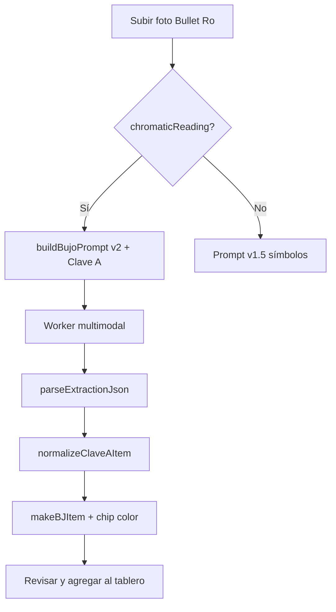

# Design Sprint — Lectura Crómática Clave A en table-ro

**Usuario:** Rö / viento norte  
**Producto:** [table-ro](https://vientonorte.github.io/table-ro/)  
**Feature:** Aplicar **lectura crómática Clave A** (protocolo Bullet Ro / `bujo-ro` v1.2) al subir una imagen en el drawer BuJo  
**Prerequisito:** Cloudflare Worker desplegado (ver guía abajo)  
**Fecha:** 19 junio 2026  
**Versión objetivo:** v1.6.0

---

## 0 · Resumen

Hoy `buildBujoPrompt()` clasifica por **símbolo** (● ◆ > * $) y contexto textual, pero **ignora el resaltado cromático** del Bullet Ro (Clave A). Rö necesita que al subir una foto del cuaderno, la IA detecte colores de marcador y asigne categoría con trazabilidad (`color` vs `symbol` vs `texto`).

**North Star:** ≥90% de ítems con color visible en foto clasificados con la categoría Clave A correcta (validación manual en 5 páginas golden).

**Guardrails:** No activar Clave B en fotos de Bullet Ro · Anonimización en `details` · Sin persistir imágenes en disco.

---

## 1 · Design Thinking

### 1.1 Empatizar

| Momento | Acción actual | Pain |
|---------|---------------|------|
| Captura semanal | Foto de página Bullet Ro → Analizar | IA ignora rosa/gris/verde/naranja/amarillo |
| Revisión paso 2 | Filtra por categoría manual | Muchos ítems caen en `personal` por defecto |
| Trazabilidad | Solo `confidence` + `symbol` | No sabe si vino del color o del bullet |
| Contra-archivo | Notas laborales en naranja | Sin `[INSTITUCIÓN]` automático en export |

**Evidencia:** `js/app.js` → `buildBujoPrompt()` líneas ~910–926: reglas por símbolo, cero mención de Clave A.

### 1.2 Definir

**Problem statement:**  
Como usuario de viento norte quiero que table-ro lea los **colores de mi Bullet Ro** al subir una imagen, para que las tareas lleguen al tablero en la categoría correcta sin reclasificar manualmente cada ítem.

**HMW priorizados:**
1. HMW mapear Clave A → `personal|vinculos|camila|trabajo|fin` sin romper el schema JSON actual?
2. HMW mostrar en UI si la categoría vino de color, símbolo o inferencia?
3. HMW resolver conflicto color naranja (laboral) vs símbolo `*` desalineado?
4. HMW aplicar anonimización `[INSTITUCIÓN]` en `details` sin tocar `text` fiel?
5. HMW degradar gracefully cuando la foto no tiene color (solo lápiz)?

### 1.3 Idear

| Idea | MoSCoW | Esfuerzo |
|------|--------|----------|
| **I1** Extender prompt con bloque Clave A completo | Must | S |
| **I2** Campo JSON `color_trace`: `{ detected, clave_a, hex_approx, source: color\|symbol\|text\|default }` | Must | M |
| **I3** Post-proceso `applyClaveA()` si IA no devuelve color | Should | M |
| **I4** Badge en `makeBJItem`: 🟥🟧🟩⬛🟨 + tooltip fuente | Must | S |
| **I5** Toggle Admin: "Priorizar color sobre símbolo" | Should | S |
| **I6** Panel "Hallazgos cromáticos" en preview IA (warnings) | Should | M |
| **I7** Golden set: 5 fotos Bullet Ro etiquetadas manualmente | Must | S (Rö) |
| **I8** Clave B auto-detect solo si `source_type: libro` (futuro) | Could | L |

**Mapeo Clave A → table-ro (v1.6):**

| Color Clave A | Categoría table-ro | Token CAL |
|---------------|-------------------|-----------|
| 🟥 Rosa | `personal` | `#EC4899` |
| ⬛ Gris | `vinculos` | `#7C3AED` |
| 🟩 Verde turquesa | `camila` | `#10B981` |
| 🟧 Naranja | `trabajo` | `#F97316` |
| 🟨 Amarillo | `personal` (nota/referencia) | `#FBBF24` — `kind: note` |

> Amarillo = referencias → no crear cat nueva; forzar `kind: note` y tag "Referencia" en UI.

**Regla de conflicto:** si `color_trace.source === 'color'` y difiere de `symbol` → gana color; registrar warning en `summary.warnings`.

### 1.4 Prototipar (3 sprints técnicos)

#### Sprint A — Prompt + schema (3 días)

| ID | Entregable |
|----|------------|
| A1 | `buildBujoPrompt()` v2 con sección `CLAVE A — LECTURA CROMÁTICA` |
| A2 | Schema JSON ampliado: `color_trace`, `source_type: bullet_ro\|texto\|libro` |
| A3 | Flag `AI_CFG.flags.chromaticReading` (default `true` si hay imágenes) |
| A4 | Anonimización en prompt: `[INSTITUCIÓN]` en details, no en text |

**Fragmento prompt (borrador):**

```
CLAVE A — BULLET RO (solo si hay imágenes)
Detecta resaltado con marcador. Tolerancia de saturación: el matiz importa, no la intensidad.
- Rosa/fucsia → type: personal
- Gris → type: vinculos
- Verde turquesa → type: camila
- Naranja → type: trabajo
- Amarillo → kind: note, type: personal
Si color y símbolo discrepan, prioriza color y registra warning.
Campo color_trace obligatorio por ítem con imagen.
```

#### Sprint B — UI + post-proceso (3 días)

| ID | Entregable |
|----|------------|
| B1 | `normalizeClaveAItem(item)` después de `parseExtractionJson` |
| B2 | `makeBJItem()` muestra chip color + `aria-label` fuente |
| B3 | Sección `#chromatic-findings` en `ai-result-preview` |
| B4 | Filtro BuJo: "Solo con color detectado" |

#### Sprint C — Validación (2 días)

| ID | Entregable |
|----|------------|
| C1 | Carpeta `tests/golden/bujo/` con 5 PNG + expected.json |
| C2 | Script `node tests/bujo-clave-a-compare.js` (diff categorías) |
| C3 | Umbral: ≥90% match en golden set |
| C4 | CHANGELOG v1.6.0 + bump SW v8 |

### 1.5 Testear

| Tipo | Método | Criterio |
|------|--------|----------|
| Golden | 5 fotos Bullet Ro | ≥90% type correcto |
| Conflicto | Foto con ● rosa + bullet * | Warning + color gana si flag on |
| Sin color | Foto lápiz solo | Fallback símbolo, 0 errors |
| A11y | pa11y chips nuevos | 0 regresión |
| Privacy | Export JSON | Sin base64 imagen persistida |
| Mobile | iPhone upload | Misma precisión ±5% |

---

## 2 · CMA — Feature Lectura Crómática

| Criterio | Medida | Aceptación |
|----------|--------|------------|
| Detección Clave A | Golden set 5 páginas | ≥90% `type` correcto |
| Trazabilidad | Cada ítem con imagen tiene `color_trace` | 100% en golden |
| Conflicto documentado | Ítem naranja + símbolo personal | Warning en `summary.warnings` |
| UI legible | VoiceOver en chip color | Anuncia categoría + fuente |
| Anonimización | Texto con empleador en details | `[INSTITUCIÓN]` en export |
| Degradación | Foto B/N o sin marcador | Clasificación por símbolo sin error |

---

## 3 · DoR / DoD v1.6

### DoR
- [x] Worker IA operativo en prod
- [ ] Golden set 5 fotos en `tests/golden/bujo/` (Rö)
- [ ] Aprobación mapeo amarillo → `note`/`personal`
- [ ] Prompt v2 revisado contra `bujo-ro` SKILL v1.2

### DoD
- [ ] `chromaticReading` flag en Admin
- [ ] Prompt + schema + post-proceso merged
- [ ] UI chips color en revisión BuJo
- [ ] Golden test ≥90%
- [ ] pa11y CI verde
- [ ] privacy.html § BuJo actualizado (lectura cromática + IA)

---

## 4 · Flujo objetivo (v1.6)



---

## 5 · Riesgos

| Riesgo | Mitigación |
|--------|------------|
| IA confunde rosa con naranja bajo luz amarilla | Golden set + warning baja confidence |
| JSON schema rompe import legacy | `color_trace` opcional, default `{}` |
| Costo tokens prompt largo | Perfil `quality` solo si ≥2 imágenes |
| Clave B activada por error en libro | `source_type` gate; Bullet Ro fuerza Clave A |

---

## 6 · Próximo paso inmediato

1. **Rö:** Desplegar Worker (guía en `HANDOFF.md` § Worker)
2. **Rö:** Subir 5 fotos golden a `tests/golden/bujo/`
3. **Dev:** Sprint A — PR `feat/bujo-clave-a-prompt`

---

*Alineado con `bujo-ro` SKILL v1.2 · Fase 6 Trazabilidad cromática · Clave A exclusiva para Bullet Ro.*