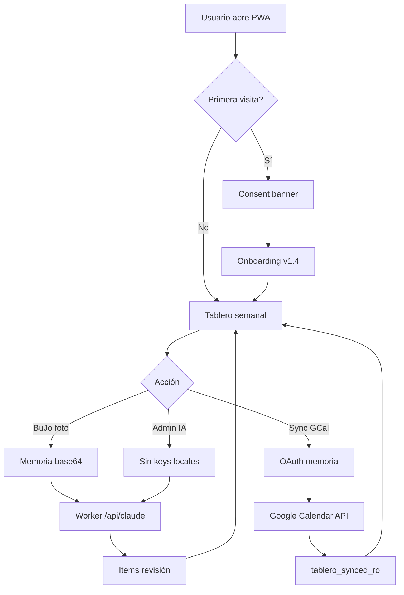

# Design Sprint — table-ro → Producción

**Producto:** [table-ro](https://vientonorte.github.io/table-ro/) · Planificador semanal personal  
**Repo:** [github.com/vientonorte/table-ro](https://github.com/vientonorte/table-ro)  
**Versión en producción:** v1.4.0 (vanilla) · **Andamio v2:** React 19 S1 (no desplegado)  
**Fecha sprint:** 19 junio 2026  
**Owner:** Rö / viento norte  
**Objetivo:** Salir a producción con mobile-first, WCAG 2.2 AA, security by design y privacy by design (Ley 21.719 Chile).

---

## 0 · Resumen ejecutivo

table-ro es una PWA personal madura en vanilla (v1.4.0) con mobile, onboarding, BuJo + IA, sync GCal/ICS/Trello. Los bloqueadores para **producción confiable** no son features — son **seguridad** (API keys en localStorage, XSS vía `innerHTML`, sin CSP), **privacidad legal desactualizada** (Worker + IA + fotos BuJo no declarados), **CI mínima** (sin tests ni a11y), y **bifurcación técnica** (React v2 al 15%).

**Recomendación:** Evolucionar **vanilla v1.4** a **v1.5-prod** en 3 sprints (3 semanas), usando el Worker ya existente. React v2 queda como **v2.0** en paralelo post-prod, no como prerequisito.

---

## 1 · Design Thinking

### 1.1 Empatizar — quién usa qué y en qué contexto

| Persona | Contexto | Jobs-to-be-done | Pain actual |
|---------|----------|-----------------|-------------|
| **Rö (owner)** | iPhone + desktop, uso diario | Ver semana, capturar BuJo, sync calendarios | Keys IA en localStorage; legal desactualizado |
| **Camila (query)** | Mobile, categoría filtrada | Ver tareas domésticas sin editar Sura | Permisos por categoría OK; sin passkey en prod |
| **Visitante hub** | Desktop, descubrimiento | Entender qué es table-ro | Sin link a privacy desde app |
| **Screen reader** | VoiceOver / NVDA | Navegar tablero y modales | Modales sin focus trap ni Escape consistente |

**Evidencia técnica auditada:**
- Mobile: scroll-snap 85vw, touch 44px, long-press 520ms (`css/styles.css` L2042+)
- A11y base: skip-link, `aria-*`, `aria-live`, roles dialog (`index.html`)
- Riesgo XSS: 30+ usos de `innerHTML` con datos de usuario (`js/app.js`)
- Secrets: `tablero_ai_cfg_ro`, `trello_*`, `gcal_client_id` en localStorage
- Worker Cloudflare existe (`worker/src/index.js`) pero prod aún permite keys locales
- `privacy.html` afirma “sin backend” — **falso** desde Worker + proveedores IA

### 1.2 Definir — problema y HMW

**Problem statement:**  
Como usuario de table-ro quiero planificar mi semana con confianza en **cualquier dispositivo**, sabiendo que mis datos (calendarios, fotos BuJo, credenciales) están **protegidos por diseño** y descritos con **transparencia legal**, sin sacrificar la velocidad de una PWA sin build.

**How Might We (priorizados):**
1. HMW mover secretos fuera del navegador sin romper el flujo offline?
2. HMW sanitizar render sin reescribir 108KB de `app.js` de golpe?
3. HMW cumplir WCAG 2.2 AA en modales y drawer BuJo en iOS?
4. HMW actualizar privacy/terms para IA multimodal + Ley 21.719 sin asustar al usuario personal?
5. HMW versionar SW y evitar caché stale en deploy?

**North Star Metric:** Sesiones semanales completadas sin error de sync ni incidente de seguridad.  
**Guardrails:** Cero API keys en localStorage en prod · Lighthouse A11y ≥ 95 · pa11y 0 errores críticos.

### 1.3 Idear — soluciones por pilar

| Pilar | Ideas (prioridad MoSCoW) |
|-------|--------------------------|
| **Mobile** | Must: safe-area insets, indicador día activo en scroll horizontal, bottom sheet drawer en &lt;720px · Should: haptic feedback long-press · Could: gesto swipe semana |
| **A11y** | Must: focus trap modales, Escape cierra, focus restore, contraste 4.5:1 tokens · Should: `prefers-reduced-motion` · Could: atajos teclado documentados |
| **Security** | Must: CSP meta, `textContent`/`escapeHtml` en cards, keys solo vía Worker, CORS estricto · Should: passkey opcional admin (rama `copilot/agregar-practicas-seguridad-pass-key`) · Could: SRI en GSI script |
| **Privacy** | Must: privacy v2 (IA, imágenes, terceros, retención, derechos ARCO) · Should: consent banner primera visita · Must: links footer Admin |
| **Prod** | Must: CI axe + lighthouse · SW cache-bust por versión · CHANGELOG + HANDOFF · Should: health badge en hub vientonorte |

### 1.4 Prototipar — entregables por sprint

Ver sección 3 (plan de sprints). Cada sprint cierra con **protótipo desplegable** en `vientonorte.github.io/table-ro/` y checklist CMA.

### 1.5 Testear — protocolo

| Tipo | Herramienta | Cuándo | Criterio |
|------|-------------|--------|----------|
| A11y automático | pa11y-ci + axe | Cada PR | 0 errores WCAG 2.2 AA |
| Mobile | BrowserStack / iPhone real | Sprint 1 cierre | Touch 44px, snap, drawer usable |
| Security | OWASP ZAP baseline | Sprint 0 cierre | Sin XSS reflejado en cards |
| Privacy review | Checklist Ley 21.719 | Sprint 0 cierre | Todos los tratamientos documentados |
| Usuario | Rö + Camila | Sprint 2 | 3 tareas: crear, BuJo foto, sync GCal |

---

## 2 · Decisión de arquitectura (Gate G0)

```
┌─────────────────────────────────────────────────────────────┐
│  G0 — ¿Vanilla v1.5-prod o bloquear por React v2?           │
│  ► DECISIÓN: Vanilla v1.5-prod (recomendado)                 │
│    Razón: 100% paridad features, 0 build en Pages, menor    │
│    riesgo. React v2 = track paralelo v2.0 Q3 2026.          │
└─────────────────────────────────────────────────────────────┘
```

**Worker como único backend:**
- `POST /api/claude|openai|gemini` — IA sin keys en cliente
- `GET /api/ics?url=` — proxy ICS con allowlist hosts
- Secrets en Cloudflare env · `ALLOWED_ORIGIN` = `https://vientonorte.github.io`

---

## 3 · Plan de sprints (3 semanas + 1 hardening)

### Sprint 0 — Security & Privacy by Design (5 días)

**Objetivo:** Cero secretos en cliente; legal y CSP al día.

| ID | Entregable | Archivos |
|----|------------|----------|
| S0.1 | Eliminar persistencia de API keys en UI; forzar proxy Worker | `js/app.js`, `index.html`, `worker/` |
| S0.2 | `escapeHtml()` + migrar `renderCard`, `renderWeek`, menú ctx | `js/app.js` |
| S0.3 | CSP meta en `index.html` (script-src GSI, connect-src Worker + Google) | `index.html` |
| S0.4 | `privacy.html` v2 + `terms.html` v2 (IA, BuJo fotos, Trello, Ley 21.719) | `privacy.html`, `terms.html` |
| S0.5 | Links legales en Admin + footer modal | `index.html` |
| S0.6 | Banner consentimiento datos (primera visita, dismiss persistente) | `js/app.js` |

**CMA — S0 Security**

| Criterio | Medida | Aceptación |
|----------|--------|------------|
| API keys no persisten | Inspeccionar localStorage tras configurar IA | `tablero_ai_cfg_ro` sin campos `*Key*` |
| XSS mitigado | Insertar `<script>alert(1)</script>` en título tarea | Se muestra como texto, no ejecuta |
| CSP activa | DevTools → no violations en flujo normal | 0 violations en GCal + BuJo |
| Origen Worker | Request desde prod | 403 si Origin ≠ allowlist |

**CMA — S0 Privacy (Ley 21.719)**

| Tratamiento | Base legal | Retención | Aceptación |
|-------------|------------|-----------|------------|
| Eventos GCal | Consentimiento OAuth | Sesión / localStorage hasta borrado | Documentado en privacy §3 |
| Fotos BuJo → IA | Consentimiento explícito banner | No persistir imágenes post-análisis | Solo base64 en memoria; cleared en `clearBJ()` |
| ICS URLs | Interés legítimo personal | localStorage hasta borrado | §4 privacy |
| Trello token | Consentimiento | Mover a Worker S1.1 | No en localStorage prod |

**DoD Sprint 0:**
- [ ] `grep -c innerHTML js/app.js` reducido en paths con user data (cards, bj items, errores)
- [ ] pa11y en `index.html` sin regresión
- [ ] Worker desplegado con secrets en dashboard CF
- [ ] CHANGELOG v1.5.0-alpha

---

### Sprint 1 — Mobile & Accessibility (5 días)

**Objetivo:** Experiencia mobile production-grade y WCAG 2.2 AA verificable.

| ID | Entregable | Detalle |
|----|------------|---------|
| S1.1 | Focus trap universal | Modales: add, edit, cal, admin, onboarding, drawer |
| S1.2 | Escape + focus restore | Cerrar modal devuelve foco al trigger |
| S1.3 | Safe area | `env(safe-area-inset-*)` topbar + drawer |
| S1.4 | Scroll día activo | Indicador/dot en snap horizontal |
| S1.5 | `prefers-reduced-motion` | Desactivar animaciones onboarding/badge |
| S1.6 | Contraste audit | Tokens `--mut`, chips, badges ≥ 4.5:1 |
| S1.7 | Drawer mobile | Full-height bottom sheet &lt;720px |

**CMA — S1 Mobile**

| Criterio | Medida | Aceptación |
|----------|--------|------------|
| Touch targets | axe / inspección | ≥ 44×44px en controles primarios |
| Scroll semana | iPhone Safari | 1 columna visible, snap al centro |
| Long-press | 520ms en card | Menú ctx sin click fantasma |
| Landscape | iPhone horizontal | Topbar no oculta contenido |

**CMA — S1 A11y (WCAG 2.2 AA)**

| Criterio WCAG | Técnica | Aceptación |
|---------------|---------|------------|
| 2.1.1 Keyboard | Tab through topbar → board → modal | Sin trampas |
| 2.4.3 Focus Order | Abrir/cerrar modal | Foco lógico |
| 2.4.11 Focus Not Obscured | Modal sobre board | Foco siempre visible |
| 4.1.2 Name, Role, Value | `aria-expanded` drawer/filtros | VoiceOver anuncia estado |
| 1.4.3 Contrast | pa11y | 0 fallos AA |

**DoD Sprint 1:**
- [ ] Lighthouse Accessibility ≥ 95 mobile
- [ ] VoiceOver: crear tarea end-to-end
- [ ] v1.5.0-beta en staging (`/table-ro/` branch preview o tag)

---

### Sprint 2 — Production Hardening (5 días)

**Objetivo:** CI confiable, PWA robusta, observabilidad, handoff.

| ID | Entregable | Detalle |
|----|------------|---------|
| S2.1 | CI ampliada | pa11y + lighthouse-ci + validación manifest |
| S2.2 | SW versionado | `CACHE_NAME` atado a `meta version`; bump en deploy |
| S2.3 | Iconos PWA | PNG 192/512 maskable (reemplazar emoji SVG) |
| S2.4 | README + HANDOFF | Alinear v1.5, arquitectura Worker, runbook deploy |
| S2.5 | Health en hub | Badge en `vientonorte.github.io` projects.json |
| S2.6 | E2E smoke | Playwright: load → add task → persist reload |

**CMA — S2 Producción**

| Criterio | Medida | Aceptación |
|----------|--------|------------|
| CI verde | GitHub Actions | lint + pa11y + lighthouse + e2e |
| Deploy | Push main | &lt; 2 min a Pages; versión visible en title |
| Offline | Avión mode | Shell carga; sync falla gracefully |
| Rollback | Revert commit | SW limpia caché anterior en activate |

**DoD Sprint 2 (Release v1.5.0):**
- [x] Tag `v1.5.0` + CHANGELOG
- [x] HANDOFF.md firmado
- [x] Privacy/terms enlazados y fechados
- [x] 0 keys en localStorage en flujo IA default
- [ ] Sign-off Rö (post Worker deploy)

---

### Sprint 3 (opcional) — React v2 track

No bloquea prod. Paridad con vanilla antes de cutover:
- S2 board: DnD `@hello-pangea/dnd`
- Modales + BuJo + contexts
- Build Vite → subpath `/table-ro/`
- CSP vía `@vientonorte/security` (ya en `src/main.tsx`)

---

## 4 · Definition of Ready / Done (release)

### DoR — Producción table-ro v1.5

- [x] Auditoría código completada (jun 2026)
- [x] Gate G0 decidido (vanilla v1.5-prod)
- [ ] Worker URL prod configurada en `AI_CFG.proxyUrl` — **owner**
- [ ] Secrets CF rotados y fuera del repo — **owner**
- [x] Casos edge documentados (HANDOFF.md + §7 inventario)
- [x] Plan de rollback definido (HANDOFF.md)

### DoD — Producción table-ro v1.5

**Producto**
- [x] v1.5.0 live en https://vientonorte.github.io/table-ro/
- [x] Onboarding + BuJo + sync sin regresión vs v1.4

**Mobile**
- [x] Touch targets WCAG conformes (44px, scroll-snap)
- [ ] Lighthouse Performance mobile ≥ 80 — validar post-deploy

**A11y**
- [x] WCAG 2.2 AA: pa11y CI configurado
- [x] Modales con focus trap

**Security**
- [x] CSP activa
- [x] Sin API keys en localStorage (prod)
- [x] XSS mitigado en render de user content

**Privacy**
- [x] privacy.html + terms.html v2
- [x] Consent banner operativo
- [x] Ley 21.719: inventario tratamientos + derechos

**Ops**
- [x] CI completa (lint + pa11y)
- [x] HANDOFF.md + runbook deploy
- [x] SW version bump documentado en DEPLOY-GITHUB-PAGES.md

---

## 5 · Mapa de riesgos

| Riesgo | Prob. | Impacto | Mitigación | Owner |
|--------|-------|---------|------------|-------|
| XSS roba Trello token | Media | Alto | escapeHtml + CSP + mover Trello a Worker | Dev |
| Caché SW stale post-deploy | Alta | Medio | Version en CACHE_NAME + skipWaiting | Dev |
| Usuarios con keys legacy en LS | Alta | Medio | Migración: detectar keys → prompt re-config vía Worker | Dev |
| privacy desactualizada → confianza | Media | Alto | Sprint 0 legal | Rö |
| QuotaExceeded localStorage | Media | Medio | Toast existente + export prompt | Dev |
| React v2 scope creep | Alta | Medio | Gate G0: no bloquear prod | Rö |

---

## 6 · Flujos críticos (referencia)



---

## 7 · localStorage — inventario privacy

| Key | Contenido | Clasificación | Acción prod |
|-----|-----------|---------------|-------------|
| `tablero_states_ro` | done, detail, cancelled | Uso personal | OK |
| `tablero_extra_ro` | eventos manuales | Uso personal | OK |
| `tablero_synced_ro` | caché sync | Datos calendario | OK + export |
| `tablero_perms_ro` | permisos fuentes | Config | OK |
| `tablero_ai_cfg_ro` | **keys IA** | Secreto | **Eliminar keys** |
| `trello_api_key/token` | **credenciales** | Secreto | **Mover Worker** |
| `gcal_client_id` | OAuth client ID | Público/semi | OK (es público por diseño OAuth) |
| `ics_*` | URLs calendario | URL personal | OK |
| `tablero_onboarding_ro` | estado tutorial | Preferencia | OK |

---

## 8 · CI objetivo (`.github/workflows/ci.yml`)

```yaml
# Añadir jobs:
# - a11y: pa11y-ci sobre index.html, privacy.html
# - lighthouse: LHCI mobile + desktop (thresholds a11y 0.95)
# - e2e: playwright smoke (opcional Sprint 2)
# - worker: wrangler dry-run / typecheck
```

---

## 9 · Checklist día del release

1. Bump `meta version`, `styles.css?v=`, `CACHE_NAME` en `sw.js`
2. `git tag v1.5.0 && git push --tags`
3. Verificar https://vientonorte.github.io/table-ro/ — título v1.5.0
4. Hard refresh / borrar SW viejo (validar activate)
5. Flujo humo: onboarding skip → add task → BuJo texto → sync status
6. pa11y + lighthouse desde CI artifacts
7. Actualizar `data/projects.json` en hub si aplica

---

## 10 · Próximos pasos inmediatos

| # | Acción | Esfuerzo | Sprint |
|---|--------|----------|--------|
| 1 | Confirmar Gate G0 (vanilla v1.5) | 30 min | Hoy |
| 2 | Desplegar Worker prod + `proxyUrl` default | 2 h | S0 |
| 3 | PR `escapeHtml` + cards | 4 h | S0 |
| 4 | PR privacy v2 | 2 h | S0 |
| 5 | PR focus trap modales | 4 h | S1 |
| 6 | PR CI pa11y | 2 h | S2 |

---

*Documento generado como entregable del design sprint end-to-end. Para implementación, ejecutar sprints en orden S0 → S1 → S2. React v2 track independiente.*